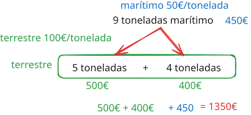

## Ejercicio
Crea una app que calcule gastos de transporte, terrestres y marítimos, para la península ibérica. Hay que transportar una mercancía entre A y B. Puede ser que en medio no podamos pasar de A a B porque hay algún problema en el terreno, y que por eso hay que hacerlo a nivel marítimo. Limitante: 1 solo transporte terrestre (5 toneladas máximo).

   

Formas posibles de transporte:
- Tierra 
	- Camión: máximo 5 toneladas por camión
- Mar
	- Cantidad ilimitada
	- Sólo si hay mar
	- Menor coste que camión
- Ambos
	- Priorizar menor coste. 

Dividirnos en 3 grupos. Cada uno con su repositorio. 5 ramas: main, dev, brian, qesem, nacho